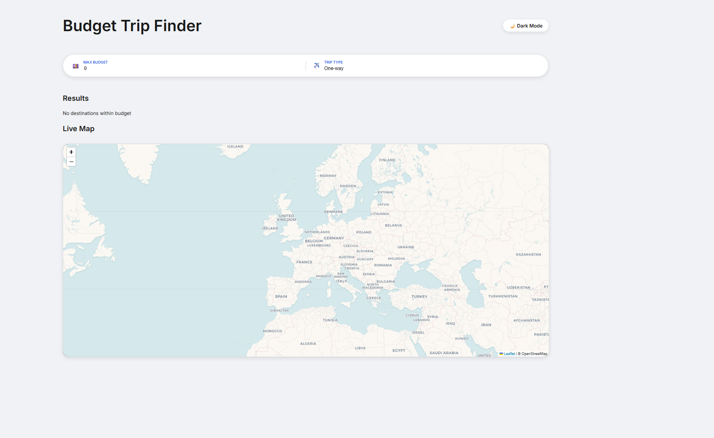
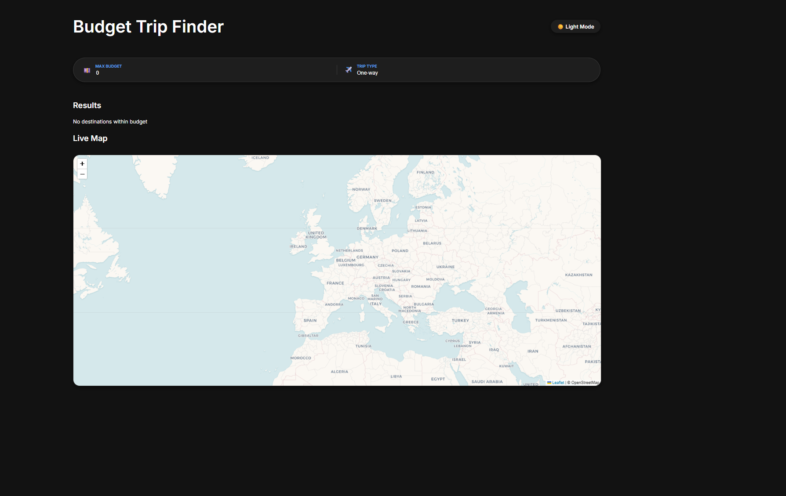
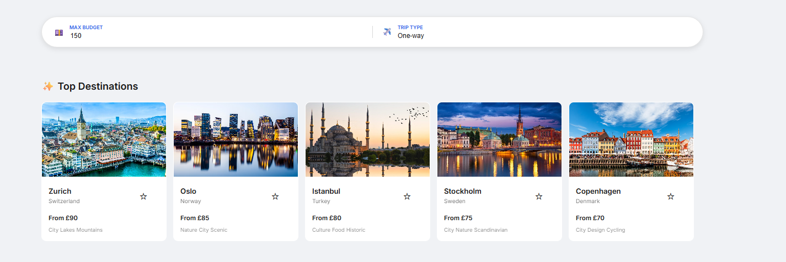
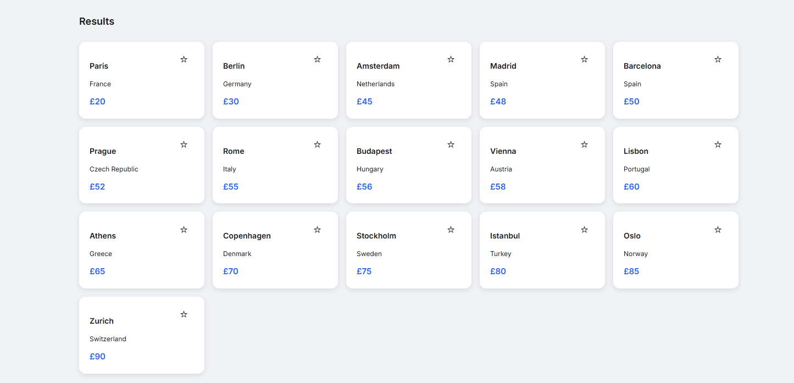
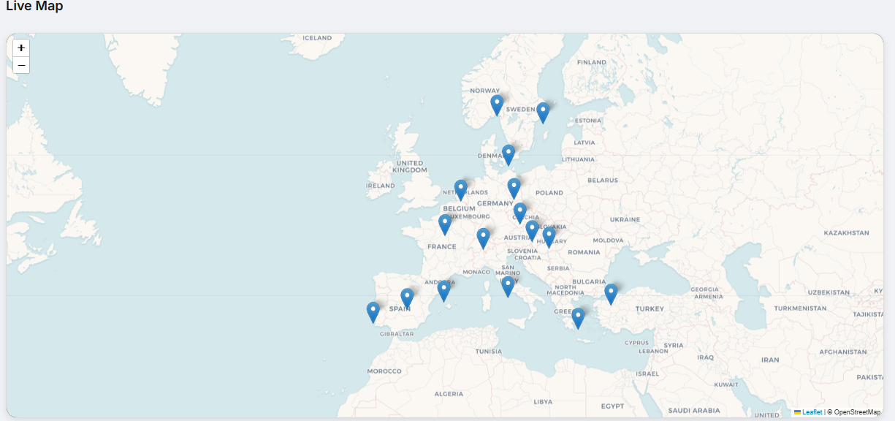

✈️ Budget Trip Finder
A modern React application built with Vite that helps travelers find destinations within their budget, explore them on a live interactive map, and save their favorite trips for later.

Demo / Screenshots

Demo video: [_Youtube Link_ ](https://youtu.be/JsC6KJr8Htg?si=MaTbxUPbdMd3Quyj)

Screenshots

🚀 Features
Budget Filtering + Sorting: Filter destinations by a maximum budget and instantly sort results from cheapest to most expensive.

Trip Type Toggle: Seamlessly switch between oneWayPrice and returnPrice to see accurate totals.

✨ Premium Picks: A curated section highlighting the top 5 best-value destinations within your current budget.

Live Interactive Map: * Powered by React Leaflet.

Smooth fly-to animations when selecting destinations.

Custom markers (via mapicons.js) that change styles for saved trips.

Persistent Saved Trips: Save/unsave trips directly from the list or map. Data persists across sessions using LocalStorage with versioning to prevent data conflicts.

Responsive Dark/Light Mode: Clean UI with consistent styling using CSS variables and data-theme.

🛠️ Tech Stack
Framework: React (Functional Components & Hooks)

Build Tool: Vite

Mapping: React Leaflet 

Persistence: LocalStorage 

Styling: CSS3 (Variables & Responsive Layout)

📂 Project Structure
src/
├── assets/             # Destination images (Amsterdam, Tokyo, etc.)
├── components/         # UI Components
│   ├── mapview/        # Map logic, icons, and styling
│   ├── premiumpicks/   # "Top Destinations" logic and styling
│   └── searchbar/      # Search and budget filter logic
├── data/               # Centralized destination data (destination.js)
├── App.jsx             # Main application container
└── main.jsx            # Entry point

🚦 Getting Started
Prerequisites
Node.js (v18 or higher recommended)

npm ### Installation & Setup

1. Install dependencies:
npm install
2. Run the development server:
npm run dev
